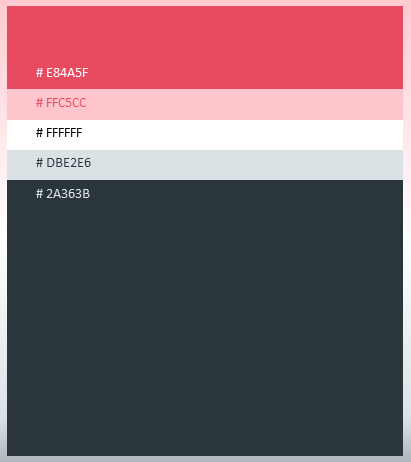

# Booking App

This is a mobile application that manages bookings. Users can create, view, and delete their bookings through this application. Each villa has an account, and under each account, there are multiple users, each having their name, phone number, and email id. As of now, all of the users are equal, and can add or remove other users from the villa account. However, in the future, I am planning to implement a special administrator account, which will have the sole authority to add or remove users from their villa account.

<h3>Frontend used</h3>

I have chosen Flutter as the frontend framework for my project due to its numerous advantages. One of its standout features is its cross-platform compatibility, which allows me to develop applications that work seamlessly on both Android and iOS devices. Additionally, Flutter boasts a rich library of widgets, making it easier to create a visually appealing and functional user interface. Another noteworthy benefit is the ability to maintain consistent UI and logic across different platforms, ensuring a unified user experience. 
This mobile application is currently only compatible with the Android OS, since iOS development typically requires macOS, which is not available on Windows OS. However, non-Android can still access the application through its web-hosted version. Thanks to Flutter's cross-platform capabilities, I was able to replicate the same interface design on the web, ensuring a cohesive user experience across all platforms.

<h3>Design principle used</h3>

I've adopted a minimalist approach in the UI/UX design of this application, with the primary goal of providing users with a straightforward and comfortable experience. This design philosophy ensures that users won't encounter any unnecessary complexities or discomfort while using the app. Leveraging Flutter's exceptional flexibility in UI design, I was able to craft custom widgets such as text boxes and buttons that align perfectly with the intended theme, maintaining a cohesive and visually appealing user interface.

<h3>Color palette used</h3>

<h3>Backend and database used</h3>

The only significant area where I have used the Node.js backend server is to differentiate between admins and regular users while logging in. For this, I used the Firebase Admin SDK, using which I can create custom claims for each user. This way, I can differentiate between admins and regular users, and provide them with different functionalities. For example, only admins can add or remove users from their villa account. Regular users can only view and delete their bookings. This way, I can ensure that the application is secure and that users can only access the functionalities that they are supposed to. Also, using a backend server instead of frontend functions ensures that the application is secure, as those functions do not run on the client side, and hence cannot be tampered with. I have directly embeded the functions involving booking, as it simplifies the development process and reduces the number of API calls made to the server. This way, the application is faster and more responsive. 
For the database, I've opted for Google Firestore, a NoSQL document database. It's an ideal choice for small to medium-scale mobile application, offering the flexibility of schema-less data structures, real-time synchronization, and scalability to accommodate potential growth. Firestore's dynamic nature ensures adaptability to evolving data requirements, while its real-time capabilities enhance user interaction. This decision ensures a robust and efficient backend infrastructure tailored to the application.
